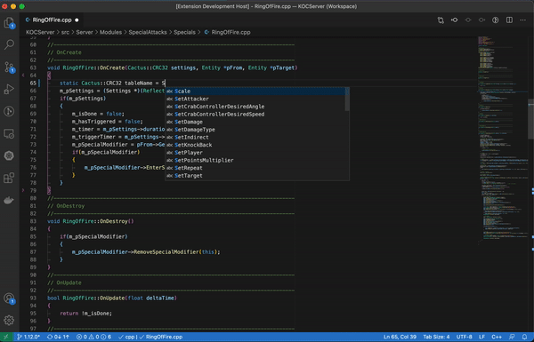

# CRCCalc README
Simple plugin to calculate the CRC of a document or selected text
## Features

- 32 bit CRC algorithms (BZIP2, C, D, MPEG-2, POSIX, Q, JAMCRC, XFER)
- 16 bit CRC algorithms (CCITT-FALSE, ARC, 0xBB3D, AUG-CCITT, BUYPASS, CDMA2000, DDS-110, DECT-R, DECT-X, DNP, EN-13757, GENIBUS, MAXIM, MCRF4XX, RIELLO, T10-DIF, TELEDISK, TMS37157, USB, A, KERMIT, MODBUS, X-25, XMODEM)
- 8 bit CRC algorithms (CDMA2000, DARC, DVB-S2, EBU, I-CODE, ITU, MAXIM. ROHX, WCDMA)

## Release Notes

### 0.2.0

- Added support to calculate RC for the whole document
- New setting to be switch between Hexadecimal and Decimal output
- New setting to display checksum as a information box instead of replacing text

### 0.1.1

Initial release

-----------------------------------------------------------------------------------------------------------

**Enjoy!**
